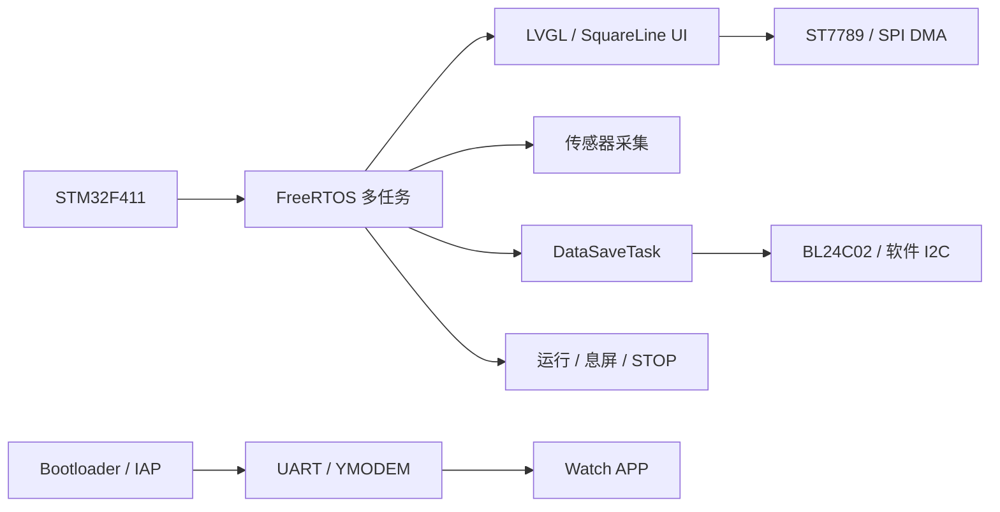
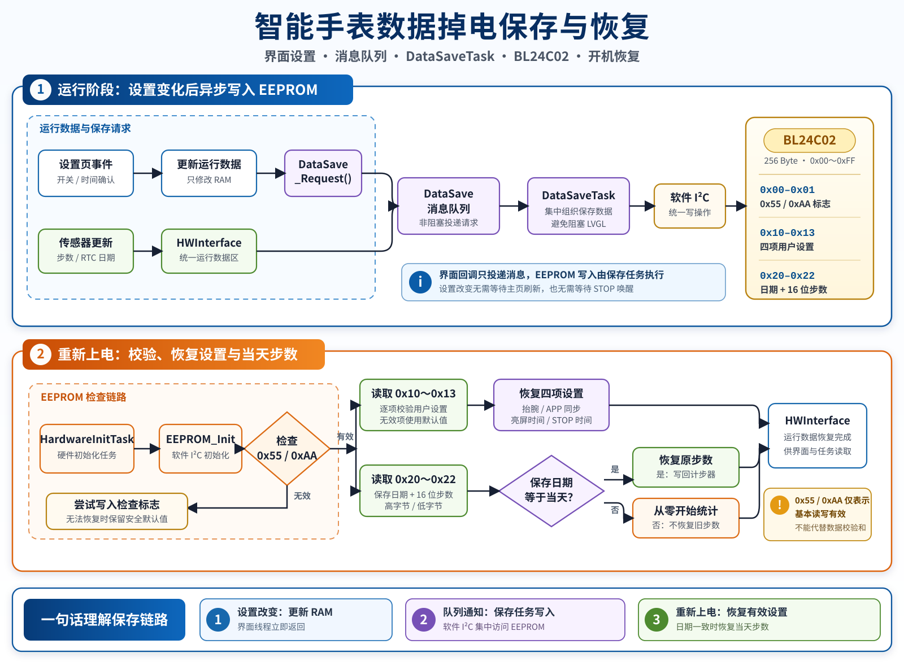

# STM32F411 Low-Power Smartwatch

基于 **STM32F411 + FreeRTOS + LVGL** 的低功耗智能手表嵌入式系统。项目包含 FreeRTOS 多任务调度、LVGL 图形交互、完整异步 SPI DMA 显示刷新、传感器数据采集、BL24C02 设置与每日步数掉电保存、三级低功耗管理，以及基于 UART/YMODEM 的 Bootloader/IAP 固件升级。

## 项目组成

| 目录 | 说明 |
| --- | --- |
| `OV_Watch` | 智能手表 APP，包含 FreeRTOS 任务、LVGL 界面、传感器驱动、EEPROM 数据保存、低功耗管理及异步 SPI DMA 显示刷新 |
| `IAP_F411改进` | Bootloader/IAP，负责通过 UART/YMODEM 接收、校验并写入 APP 固件 |

## 技术栈

- **MCU：** STM32F411CEU6
- **RTOS：** FreeRTOS，使用任务优先级、消息队列、软件定时器和任务通知
- **GUI：** LVGL 8.2、SquareLine UI、PageManager 页面管理
- **通信与外设：** SPI、I2C、UART、DMA、RTC、ADC、BL24C02 EEPROM
- **升级方案：** Bootloader/IAP、YMODEM、CRC16、Flash 分区与 APP Flag
- **开发工具：** STM32CubeMX、Keil MDK-ARM

## 系统结构

## 核心实现

### 1. FreeRTOS 多任务架构

- 按功能拆分 GUI 刷新、硬件初始化、按键、传感器采集、数据保存、消息处理和看门狗等任务
- 结合任务优先级、消息队列和软件定时器进行任务协同
- 通过 PageManager 管理页面栈，通过 HWDataAccess 解耦 UI 与底层驱动

### 2. LVGL 界面与异步 SPI DMA 刷新

原版显示刷新调用 SPI DMA 后会轮询 DMA 剩余计数，LVGL 任务需要原地等待传输完成。改进版使用：

- LVGL 双缓冲绘制
- SPI DMA 非阻塞启动
- SPI 发送完成及错误回调
- FreeRTOS 任务通知同步等待任务
- DMA 完成后调用 `lv_disp_flush_ready()` 通知 LVGL
- 编译开关保留 SPI 轮询刷新方式，便于对比和回退

### 3. 设置与每日步数掉电保存

界面事件只更新运行数据并向 `DataSave_MessageQueue` 投递保存请求，`DataSaveTask` 集中执行软件 I2C 写入，避免 EEPROM 写操作阻塞 LVGL。开机时由 `HardwareInitTask` 校验 EEPROM 标志并恢复有效数据。

| EEPROM 地址 | 保存内容 |
| --- | --- |
| `0x00`、`0x01` | 固定标志 `0x55`、`0xAA`，用于基本读写有效性检查 |
| `0x10` | 抬腕亮屏使能 |
| `0x11` | 允许 APP 同步时间 |
| `0x12` | 正常亮度保持时间 |
| `0x13` | 进入 STOP 模式时间 |
| `0x20` | 上次保存日期 |
| `0x21`、`0x22` | 当天步数高 8 位、低 8 位 |

设置开关和息屏时间发生变化时会立即通知保存任务。若保存日期与当天一致，开机恢复原步数；日期不同则从零开始统计。`0x55`、`0xAA` 仅用于基本有效性检查，不等同于数据校验和。

### 4. 实测优化结果

| 测试场景 | 原版 | 异步 DMA 改进版 | 结果 |
| --- | ---: | ---: | --- |
| 主页面正常运行时系统 CPU 占用率 | 8.2% | 7.9% | 降低 0.3 个百分点 |
| 连续进行 20 次页面切换 | 基准值 | 改进后 | CPU 忙碌时间减少约 21.3% |

### 5. 低功耗管理

系统设计运行、息屏和 STOP 三级功耗模式，并结合背光控制、外设关闭、RTC 及按键/充电事件唤醒降低功耗。

| 模式 | 实测电流 |
| --- | ---: |
| 正常运行 | 约 84 mA |
| 低背光 | 约 60 mA |
| STOP 模式 | 约 4 mA |

### 6. Bootloader / IAP 升级

- Flash 分区：32 KB Bootloader、16 KB APP Flag、464 KB APP
- 通过 UART/YMODEM 接收固件并写入内部 Flash
- 对数据包执行 CRC16 校验，错误数据不会写入 Flash
- 完成标准双 EOT 结束握手
- 擦除 APP Flag 失败时中止升级
- 跳转 APP 前校验 Flag，降低异常升级后跳转到无效程序的风险

## Git 版本记录

### Watch APP

- [`app-v1.0-spi-polling`](https://github.com/duli07556-sudo/low-power-smartwatch/tree/app-v1.0-spi-polling)：SPI DMA 忙等待刷新版本
- [`app-v2.0-async-dma`](https://github.com/duli07556-sudo/low-power-smartwatch/tree/app-v2.0-async-dma)：基于完成中断和任务通知的异步 DMA 刷新版本
- [查看 APP 刷新优化前后的差异](https://github.com/duli07556-sudo/low-power-smartwatch/compare/app-v1.0-spi-polling...app-v2.0-async-dma)

### Bootloader / IAP

- [`iap-v1.0-original`](https://github.com/duli07556-sudo/low-power-smartwatch/tree/iap-v1.0-original)：IAP 原版
- [`iap-v2.0-improved`](https://github.com/duli07556-sudo/low-power-smartwatch/tree/iap-v2.0-improved)：增加 CRC16、EOT 握手、Flash 擦除检查和 APP Flag 校验
- [查看 IAP 改进前后的差异](https://github.com/duli07556-sudo/low-power-smartwatch/compare/iap-v1.0-original...iap-v2.0-improved)

## 打开工程

1. 使用 STM32CubeMX 打开对应目录下的 `.ioc` 文件查看芯片及外设配置。
2. 使用 Keil MDK-ARM 打开 `MDK-ARM` 目录下的 `.uvprojx` 文件。
3. APP 独立性能测试可使用 Flash 基地址 `0x08000000`；与 IAP 组合部署时，APP 链接地址应使用分区起始地址 `0x0800C000`。

编译产生的目标文件、链接文件、固件文件和日志不纳入 Git 版本管理，可在本地重新编译生成。
