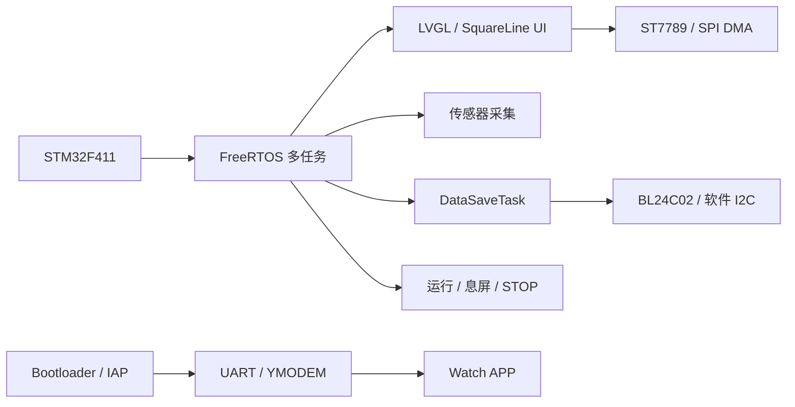
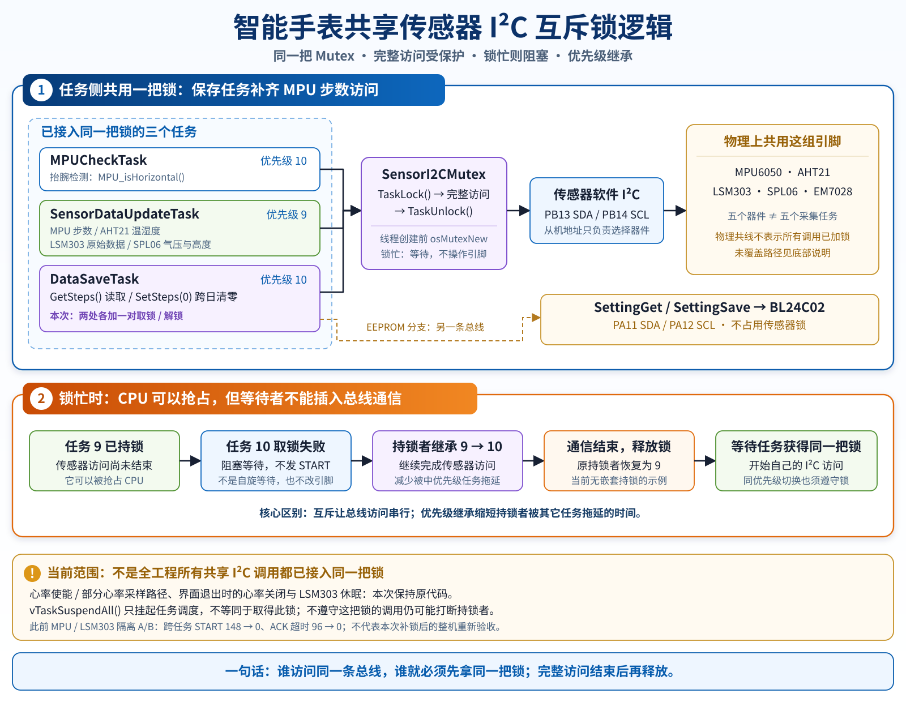
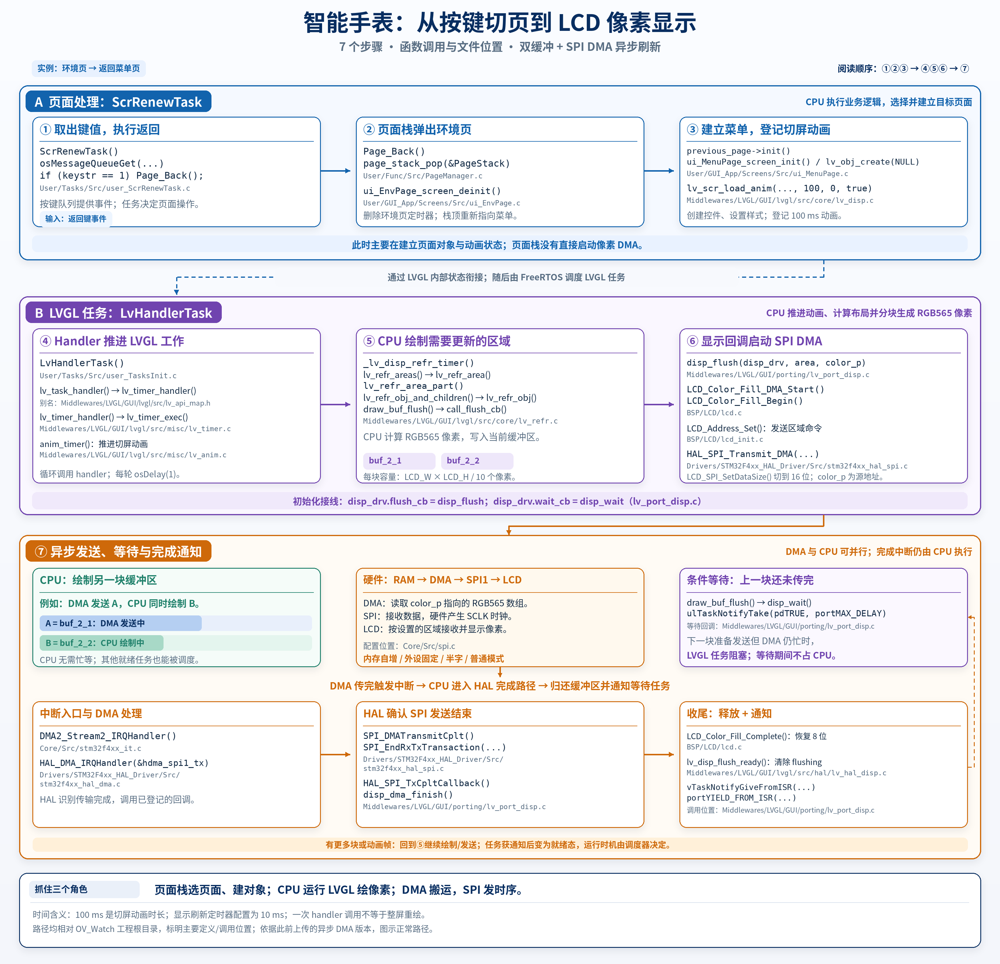
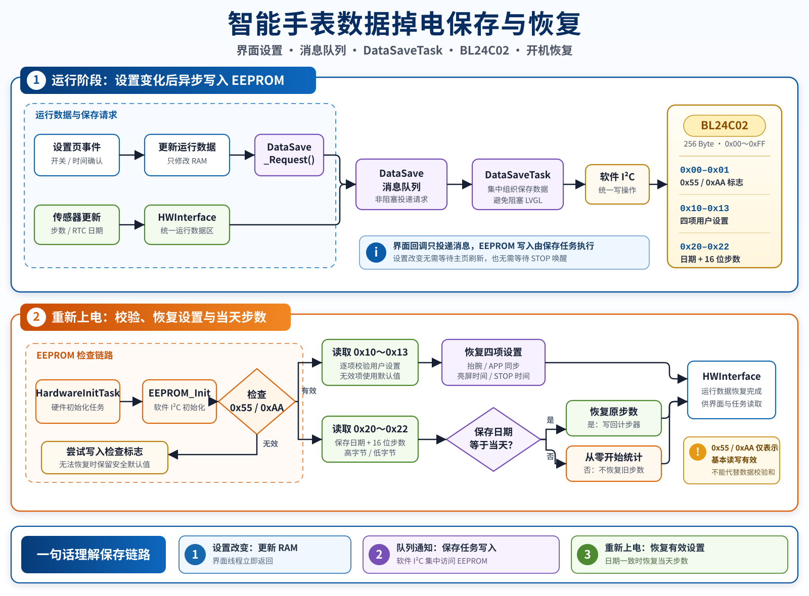

# STM32F411 Low-Power Smartwatch

基于 **STM32F411 + FreeRTOS + LVGL** 的低功耗智能手表嵌入式系统。项目包含 FreeRTOS 多任务调度、LVGL 图形交互、完整异步 SPI DMA 显示刷新、传感器数据采集、BL24C02 设置与每日步数掉电保存、三级低功耗管理，以及基于 UART/YMODEM 的 Bootloader/IAP 固件升级。

共享传感器 I²C 采用任务级互斥：抬腕检测、常规传感器更新和数据保存中的 MPU 步数访问使用同一把 FreeRTOS Mutex，支持阻塞等待与优先级继承。当前覆盖范围及未接入路径见下图和说明。

## 项目组成

| 目录 | 说明 |
| --- | --- |
| `OV_Watch` | 智能手表 APP，包含 FreeRTOS 任务、LVGL 界面、传感器驱动、EEPROM 数据保存、低功耗管理及异步 SPI DMA 显示刷新 |
| `IAP_F411改进` | Bootloader/IAP，负责通过 UART/YMODEM 接收、校验并写入 APP 固件 |

## 技术栈

- **MCU：** STM32F411CEU6
- **RTOS：** FreeRTOS，使用任务优先级、消息队列、软件定时器和任务通知
- **GUI：** LVGL 8.2、SquareLine UI、PageManager 页面管理
- **通信与外设：** SPI、I2C、UART、DMA、RTC、ADC、BL24C02 EEPROM
- **升级方案：** Bootloader/IAP、YMODEM、CRC16、Flash 分区与 APP Flag
- **开发工具：** STM32CubeMX、Keil MDK-ARM

## 系统结构

```mermaid
flowchart LR
    MCU[STM32F411] --> RTOS[FreeRTOS 多任务]
    RTOS --> GUI[LVGL / SquareLine UI]
    RTOS --> Sensor[传感器采集]
    RTOS --> Save[DataSaveTask]
    RTOS --> Power[运行 / 息屏 / STOP]
    GUI --> LCD[ST7789 / SPI DMA]
    Save --> EEPROM[BL24C02 / 软件 I2C]
    Boot[Bootloader / IAP] --> YMODEM[UART / YMODEM]
    YMODEM --> APP[Watch APP]
```

## 核心实现

### 1. FreeRTOS 多任务架构

- 按功能拆分 GUI 刷新、硬件初始化、按键、传感器采集、数据保存、消息处理和看门狗等任务
- 结合任务优先级、消息队列和软件定时器进行任务协同
- 通过 PageManager 管理页面栈，通过 HWDataAccess 解耦 UI 与底层驱动

#### 共享传感器 I²C 的任务级互斥

**为什么需要加锁：** MPU6050、AHT21、LSM303、SPL06 和 EM7028 共用 PB13（SDA）/PB14（SCL）。I²C 地址区分从机，但不能防止两个任务交错修改同一组引脚。高优先级抢占或同优先级时间片切换，都可能发生在一次完整通信中间；因此必须由访问者共同遵守同一把锁，不能只给一个任务加锁。

**当前实现：** `user_TasksInit.c` 在线程创建前调用 `osMutexNew(NULL)` 创建 `SensorI2CMutexHandle`，通过 `SensorI2C_TaskLock()` / `SensorI2C_TaskUnlock()` 统一取锁、释放。当前 CMSIS-FreeRTOS 适配层将它映射为 `xSemaphoreCreateMutex()`，具备优先级继承。头文件 `user_TasksInit.h` 中 `SENSOR_I2C_TASK_MUTEX_ENABLE` 为 `1U`；`0U` 仅是无锁对照/诊断模式，不应作为正常运行配置。

| 使用同一把锁的任务 | 当前优先级 | 保护的传感器访问 |
| --- | ---: | --- |
| `MPUCheckTask` | 10 | `MPU_isHorizontal()`，用于抬腕检测 |
| `SensorDataUpdateTask`（线程名 `SensorDataTask`） | 9 | MPU 步数、AHT21 温湿度、LSM303 唤醒及原始数据读取、SPL06 气压/高度读取 |
| `DataSaveTask` | 10 | `HWInterface.IMU.GetSteps()` 读取步数；跨日时 `HWInterface.IMU.SetSteps(0)` 清零步数（本次补齐） |

取锁先尝试零等待获取；若锁忙，记录等待次数后阻塞等待，**不执行传感器 I²C 操作**。例如任务9持锁时，任务10可以抢占CPU，但取锁失败后会阻塞；内核将持锁任务临时提升到10，待其完成访问并释放后，等待者才能进入。当前无嵌套持锁情形下，原持锁任务恢复基础优先级9。互斥锁保护的是资源访问，不是禁止CPU切换任务。

锁范围包住完整的传感器操作，而非每个独立 `START`、字节或 `STOP`；驱动内的重复 START、多次寄存器访问也在保护范围内。本次只在保存任务的 MPU 步数读/清零前后各加一对取锁/解锁，复用既有接口和头文件，未改变任务优先级、消息队列、EEPROM 保存流程或驱动结构。

**两条总线分开：** BL24C02 EEPROM 使用 PA11（SDA）/PA12（SCL），不同于传感器总线；`SettingGet()` / `SettingSave()` 不占用这把传感器锁。当前运行阶段 EEPROM 读写由保存任务集中执行；若以后增加多个运行任务访问 EEPROM，应为该总线独立设计互斥，不能仅因引脚不同就认定它永远不需要锁。

**仍需明确的边界：** 心率任务的 `EM7028_hrs_Enable()` 等调用，以及界面退出时的 `EM7028_hrs_DisEnable()` / `LSM303DLH_Sleep()` 尚未全部接入此锁；原心率采样段仍保留 `vTaskSuspendAll()` / `xTaskResumeAll()`。挂起调度并不等同于获得互斥锁，也不能保证不打断已经持锁、尚未完成的别人的通信。硬件初始化保留原调度保护，`StopEnterTask` 的创建仍被注释。上述路径本次均未修改，因此不能宣称“全工程所有 I²C 访问已经统一加锁”，更不能将互斥改进当作指南针校准或漂移问题的完整修复。

**此前受控硬件 A/B 测试（2026-10-03）：** 隔离测试 `MPUCheckTask` 与指南针采集路径，每版连续20个窗口，其中10个正常周期（MPU 300ms / LSM303 500ms）、10个压力周期（MPU 17ms / LSM303 500ms）。两版有效统计时间合计约907秒，软件插桩和观测条件一致；17ms仅用于压力测试，正式版仍为300ms。

| 条件（每版10窗口） | 无锁：跨任务 START 调用 / ACK 超时 | 有锁：跨任务 START 调用 / ACK 超时 |
| --- | ---: | ---: |
| 正常周期 | 22 / 11 | 0 / 0 |
| 压力周期 | 126 / 85 | 0 / 0 |
| 合计 | 148 / 96 | 0 / 0 |

上述有锁测试最长等待为3tick（1tick=1ms），释放前观察到任务优先级升至10，测试结束读取到当前/基础优先级均为9、持锁数0。跨任务 START 指另一任务在未结束的软件帧区间进入 START 钩子，包含重复 START，**不等于CPU抢占次数或独立冲突次数**。正式版保留的 `g_sensor_i2c_wait_count` 记录锁等待，`g_sensor_i2c_max_wait_ticks` 记录最长等待tick，`g_sensor_i2c_ack_error_count` 则累计所有软件I²C总线的ACK超时，不能直接与过滤后的测试窗口数比较。

这些结果是此前两个任务的受控对照数据，不是所有页面、全部传感器或本次 `DataSaveTask` 补锁的重新实测；不能据此承诺整机永不出错，也不能将3ms当作正式应用全部持锁路径的等待上限。本次保存任务补锁已通过Keil增量编译（0错误、0警告），未重跑硬件A/B测试。

### 2. LVGL 界面与异步 SPI DMA 刷新

原版显示刷新调用 SPI DMA 后会轮询 DMA 剩余计数，LVGL 任务需要原地等待传输完成。改进版使用：

- LVGL 双缓冲绘制
- SPI DMA 非阻塞启动
- SPI 发送完成及错误回调
- FreeRTOS 任务通知同步等待任务
- DMA 完成后调用 `lv_disp_flush_ready()` 通知 LVGL
- 编译开关保留 SPI 轮询刷新方式，便于对比和回退

### 3. 设置与每日步数掉电保存

界面事件只更新运行数据并向 `DataSave_MessageQueue` 投递保存请求，`DataSaveTask` 集中执行软件 I2C 写入，避免 EEPROM 写操作阻塞 LVGL。开机时由 `HardwareInitTask` 校验 EEPROM 标志并恢复有效数据。

| EEPROM 地址 | 保存内容 |
| --- | --- |
| `0x00`、`0x01` | 固定标志 `0x55`、`0xAA`，用于基本读写有效性检查 |
| `0x10` | 抬腕亮屏使能 |
| `0x11` | 允许 APP 同步时间 |
| `0x12` | 正常亮度保持时间 |
| `0x13` | 进入 STOP 模式时间 |
| `0x20` | 上次保存日期 |
| `0x21`、`0x22` | 当天步数高 8 位、低 8 位 |

设置开关和息屏时间发生变化时会立即通知保存任务。若保存日期与当天一致，开机恢复原步数；日期不同则从零开始统计。`0x55`、`0xAA` 仅用于基本有效性检查，不等同于数据校验和。

### 4. 实测优化结果

| 测试场景 | 原版 | 异步 DMA 改进版 | 结果 |
| --- | ---: | ---: | --- |
| 主页面正常运行时系统 CPU 占用率 | 8.2% | 7.9% | 降低 0.3 个百分点 |
| 连续进行 20 次页面切换 | 基准值 | 改进后 | CPU 忙碌时间减少约 21.3% |

### 5. 低功耗管理

系统设计运行、息屏和 STOP 三级功耗模式，并结合背光控制、外设关闭、RTC 及按键/充电事件唤醒降低功耗。

| 模式 | 实测电流 |
| --- | ---: |
| 正常运行 | 约 84 mA |
| 低背光 | 约 60 mA |
| STOP 模式 | 约 4 mA |

### 6. Bootloader / IAP 升级

- Flash 分区：32 KB Bootloader、16 KB APP Flag、464 KB APP
- 通过 UART/YMODEM 接收固件并写入内部 Flash
- 对数据包执行 CRC16 校验，错误数据不会写入 Flash
- 完成标准双 EOT 结束握手
- 擦除 APP Flag 失败时中止升级
- 跳转 APP 前校验 Flag，降低异常升级后跳转到无效程序的风险

## Git 版本记录

### Watch APP

- [`app-v1.0-spi-polling`](https://github.com/duli07556-sudo/low-power-smartwatch/tree/app-v1.0-spi-polling)：SPI DMA 忙等待刷新版本
- [`app-v2.0-async-dma`](https://github.com/duli07556-sudo/low-power-smartwatch/tree/app-v2.0-async-dma)：基于完成中断和任务通知的异步 DMA 刷新版本
- [查看 APP 刷新优化前后的差异](https://github.com/duli07556-sudo/low-power-smartwatch/compare/app-v1.0-spi-polling...app-v2.0-async-dma)

### Bootloader / IAP

- [`iap-v1.0-original`](https://github.com/duli07556-sudo/low-power-smartwatch/tree/iap-v1.0-original)：IAP 原版
- [`iap-v2.0-improved`](https://github.com/duli07556-sudo/low-power-smartwatch/tree/iap-v2.0-improved)：增加 CRC16、EOT 握手、Flash 擦除检查和 APP Flag 校验
- [查看 IAP 改进前后的差异](https://github.com/duli07556-sudo/low-power-smartwatch/compare/iap-v1.0-original...iap-v2.0-improved)

## 打开工程

1. 使用 STM32CubeMX 打开对应目录下的 `.ioc` 文件查看芯片及外设配置。
2. 使用 Keil MDK-ARM 打开 `MDK-ARM` 目录下的 `.uvprojx` 文件。
3. APP 独立性能测试可使用 Flash 基地址 `0x08000000`；与 IAP 组合部署时，APP 链接地址应使用分区起始地址 `0x0800C000`。

编译产生的目标文件、链接文件、固件文件和日志不纳入 Git 版本管理，可在本地重新编译生成。
